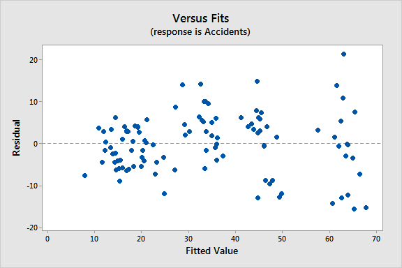

```{r setup, include=FALSE}
knitr::opts_chunk$set(echo = TRUE)
```

# Linear Regression

## Theory
Linear regression is a linear approach for modelling the relationship between a scalar response and one or more explanatory variables. The relationships are modeled using linear predictor functions (a set of coefficients and explanatory variables) whose unknown model parameters are estimated from the data, which can consequently be used to predict the outcome of response variable.

**Simple Linear Regression** - when there is one explanatory/predictor variable

**Multiple Linear Regression** - when there is more than one explanatory/predictor variable

Given a data set $\{y_i,x_{i1},x_{i2}, ... ,x_{ip}\}^n_{i=1}$ where there are n data points and p explanatory variables, the relationship can be modeled as 
$$
y_{i} = \beta_0 + \beta_1 x_{i1} + ... + \beta_p x_{ip} + \epsilon_{i} = \mathbf{x}^{\mathbf{T}}_i \mathbf{\beta} \; for \ i=1...n
$$

which then n stacked equations together are written in matrix notation as:
$$
\mathbf{y} = \mathbf{X \beta} + \epsilon
$$

### Assumptions

#### Linearity
The relationship between X and the mean of Y is linear.

Linearity can be checked by:

1. Residuals vs. predicted plot
- Curved or non-horizontally spead cloud on such a plot is diagnostic for non-linearity. To uncover more hidden (partial) non-linearity plot the residuals against each of the predictors.

#### Constant Variance (homoscedasticity)
The variance of the residual is the same for any value of X. A plot of standardized **residuals versus predicted** values can show whether points are equally distributed across all values of the independent variables.

Homoscedasticity can be checked by:

1. Residuals vs. predicted plot
- There should be no clear pattern in the distribution; if there is a cone-shaped pattern (as shown below), the data is heteroscedastic.




#### Independence
Observations are independent of each other, with little to no evidence of multicollinearity. 

**Multicollinearity** is the phenomenon when one explanatory variable can be linearly predicted from the others with a substantial degree. This will only exists in multiple linear regression.

Independence can be checked by:

1. Correlation Matrix
- When computing a matrix of Pearson's bivariate correlations among independent variables, the magnitude of the coefficients should be less than .80

2. Variance Inflation Factor (VIF)
- **VIF** indicates the degree that the variances in the regression estimates are increased due to multicollinearity. VIF values higher than 10 indicate that multicollinearity is a problem

If multicollinearity is found in the data, one possible solution is to center the data. To center the data, subtract the mean score from each observation for each independent variable. The simplest solution, however, is to identify the variables causing multicollinearity and removing those variables from the regression

#### Normality
For any fixed value of X, Y is normally distributed.

Normality can be checked by:

1. Histogram of predicted values
- Histogram should roughly reflect a normal distribution

2. Q-Q Plot
- is a quantile-quantile probability plot; a graphical method for comparing two probability distributions by plotting their quantiles against each other.

- **How it works** The set of intervals for the quantiles is chosen. A point (x,y) on the plot corresponds to one of the second distribution (y-coordinate) plotted against the same quantile of the first distribution (x-coordinate). Thus the line is a parametric curve with the parameter which is the number of the interval for the quantile.   

*better understand Q-Q plot | Weibull distribution*

3. Goodness of fit test (e.g. the Kolmogorov-Smirnov test)
- This test must be conducted on the residuals themselves

*the Kolmogorov-Smirnov test*


```{r packages, include=FALSE}
# install package function that installs the package 
# package still requires loading as library
loadPackage <- function(package) {
  if (!package %in% installed.packages())
    install.packages(package)
}
```

## Interpretations

A fitted linear regression model can be used to identify the relationship between a single predictor variable $x_j$ and the response variable $y$ when all the other predictor variables in the model are "held fixed". Specifically, the interpretation of $\beta_j$ is the expected change in $y$ for a one-unit change in $x_j$ when the other covariates are held fixed.

## Practice Example

### Loading data and packages
```{r load data and packages, message=FALSE}
loadPackage("dplyr")
library(dplyr)
library(datasets)
```

### Data Preparation
```{r}
data(iris)
data <- iris
head(data)
summary(data)
```
